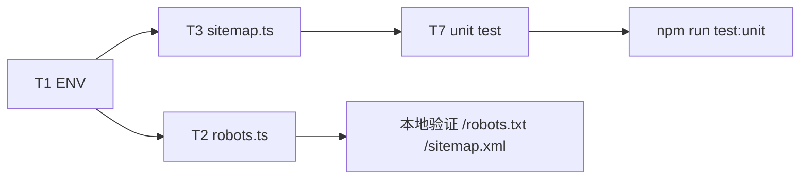

## 范围与现状对齐

本 PR 对应 [docs/geo-phase-1-plan.md](docs/geo-phase-1-plan.md) 的 T1 / T2 / T3 / T7 四个任务；T4/T5/T6 留给 PR #2。

已核对的现状（与文档一致）：

- [public/robots.txt](public/robots.txt) 含 `your-domain.com` 占位，且会覆盖 Next.js Route Handler，必须先删。
- [src/app/sitemap.ts](src/app/sitemap.ts) 用 `new Date()` 作 `lastModified`，`priority` 全为 0.7，`alternates` 只有 `zh / ja`，默认 `BASE_URL` 是占位域名。
- 仓库当前无 `.env*` 文件；`vitest.config.ts` 中 `include: ["tests/**/*.test.ts"]` 与 `environment: "node"`，新测试文件会被自动拾取。
- [src/lib/content.ts](src/lib/content.ts) 已导出 `getAllArticles(locale)`，返回的 `ArticleMeta` 已含 `publishedAt / updatedAt? / contentType / href`，T3 所需字段完备。
- Next.js 版本 16.2.4（见 [package.json](package.json)），按 [AGENTS.md](AGENTS.md) 要求：在实现前先阅读 `node_modules/next/dist/docs/` 下 `metadata` / `robots` / `sitemap` 相关文档，以当前版本为准。

## T1 环境变量

- 新建 `.env.example`，仅一行：

```env
NEXT_PUBLIC_SITE_URL=https://kibouflow.com
```

- 本地创建 `.env.local`（不提交，已默认被 Next.js 忽略；确认 [.gitignore](.gitignore) 已覆盖 `.env*.local`，如缺失则补）。
- 部署平台（Vercel 或其他）配置同名变量。所有代码路径保留 `?? "https://kibouflow.com"` 兜底，保证缺失变量时也能构建。

## T2 动态 robots

- 删除 [public/robots.txt](public/robots.txt)。
- 新建 `src/app/robots.ts`，按 [docs/geo-phase-1-plan.md](docs/geo-phase-1-plan.md) T2 清单实现：
  - 通配 `User-agent: *` allow `/`
  - 显式 allow：`GPTBot / OAI-SearchBot / ChatGPT-User / ClaudeBot / Claude-Web / anthropic-ai / PerplexityBot / Perplexity-User / Google-Extended / Googlebot / Applebot / Applebot-Extended / CCBot`
  - 显式 disallow：`Bytespider`
  - `sitemap: ${SITE_URL}/sitemap.xml`，`host: SITE_URL`
- 类型基于 `MetadataRoute.Robots`；实现前先读 `node_modules/next/dist/docs/...` 中 `robots` 的最新 API 规范，防止 16.x 有破坏性变更。

## T3 sitemap 重写

改写 [src/app/sitemap.ts](src/app/sitemap.ts)，要点：

- 默认 `BASE_URL` 改为 `"https://kibouflow.com"`（与 T1 对齐，消除 `your-domain.com`）。
- 静态页：保留 `new Date()` 作 `lastModified`（文档明确静态页可用当前时间），但补齐 `alternates.languages["x-default"]`（指向 `zh` 版 URL）。
- 文章页：把 `getAllArticleSlugs()` 换成按 locale 遍历 `getAllArticles(locale)`：
  - `lastModified = new Date(a.updatedAt ?? a.publishedAt)`
  - 用下面的 `priorityOf(contentType)` 分层：

```ts
function priorityOf(contentType?: ContentType): number {
  switch (contentType) {
    case "cluster": return 0.9;
    case "framework": return 0.85;
    case "faq": return 0.8;
    case "case": return 0.75;
    default: return 0.7;
  }
}
```

- 每条文章条目补齐 `x-default / zh / ja` 三语 alternates。
- `url` 构造继续基于 `a.href`（已是 `/guides/<category>/<slug>`）。

## T7 单元测试

新建 `tests/unit/sitemap.test.ts`，断言：

- 每条 URL 以 `BASE_URL` 开头（测试时可借助 `process.env.NEXT_PUBLIC_SITE_URL` 默认兜底值验证）。
- 同时包含 `/zh` 与 `/ja` 首页条目。
- 所有条目的 `alternates.languages` 都含 `x-default`。
- 至少一条 `contentType === "cluster"` 的文章条目（URL 通过 `"-cluster-entry"` 子串筛选）`priority >= 0.9`。
- 文章条目中至少有一条 `lastModified` 不等于"今天"，证明 frontmatter 取值生效。

测试直接 `import sitemap from "@/app/sitemap"` 并 `sitemap()` 调用；因现有 `tests/unit/content.test.ts` 已证明 `getAllArticles` 可在 Node 环境直接读 `content/**`，无需额外 mock。

## 执行顺序与验证



本地验证清单：

- `npm run dev` 后访问 `http://localhost:3000/robots.txt`：含多个 User-agent，无 `your-domain.com`。
- 访问 `http://localhost:3000/sitemap.xml`：文章 `<lastmod>` 与 MDX frontmatter 一致、`<priority>` 按 `contentType` 分层、每条带三条 `xhtml:link rel="alternate"`（x-default/zh/ja）。
- `npm run test:unit -- tests/unit/sitemap.test.ts` 全绿；`npm run test` 整体不回归。
- `npm run build` 无 metadataBase / env 相关告警（metadataBase 由 PR #2 引入，此处只确认现有构建不红）。

## 明确不做（边界）

- 不改 `src/app/layout.tsx`（T4 属 PR #2）。
- 不补各 `generateMetadata` 的 `x-default`（T5 属 PR #2）。
- 不改 `OrganizationJsonLd`（T6 属 PR #2）。
- 不新增 `llms.txt`、不改 MDX frontmatter、不引入 `buildLanguageAlternates` 工具函数。