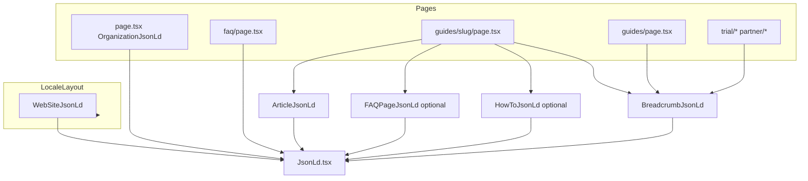

# GEO 第三阶段（结构化 JSON-LD）实施计划

## 现状与目标对齐

- **已有**：[`src/app/[locale]/guides/[category]/[slug]/page.tsx`](src/app/[locale]/guides/[category]/[slug]/page.tsx) 内联 `Article`；[`src/app/[locale]/page.tsx`](src/app/[locale]/page.tsx) 使用 [`OrganizationJsonLd`](src/components/seo/OrganizationJsonLd.tsx)；[`src/app/[locale]/faq/page.tsx`](src/app/[locale]/faq/page.tsx) 内联 `FAQPage`；`NEXT_PUBLIC_SITE_URL` 已在 Organization 中使用。
- **缺失**：通用 `<JsonLd>`、locale 布局级 `WebSite`、`BreadcrumbList`、`Article` 字段（绝对 `url`、`inLanguage`、`mainEntityOfPage` 等）、MDX 派生的 `FAQPage` / `HowTo`。
- **实施前**：按 [`AGENTS.md`](AGENTS.md) 浏览 `node_modules/next/dist/docs/` 中与 Metadata / App Router 相关的当前说明，确认 `script type="application/ld+json"` 的用法无版本差异。

## 架构数据流（概念）

## PR 拆分（与文档 T1–T8 / PR4–6 一致）

### PR4：`feat(seo): JsonLd + WebSite + Breadcrumb`

| 项 | 说明 |
|---|---|
| **T1** | 新建 [`src/components/seo/JsonLd.tsx`](src/components/seo/JsonLd.tsx)：`data` 为 `Record<string, unknown>` 或 `unknown[]`（`@graph`）；`JSON.stringify` 前剔除 `undefined`（`replacer` 或递归清理）；可选 `id`。 |
| **T3** | 新建 [`src/components/seo/WebSiteJsonLd.tsx`](src/components/seo/WebSiteJsonLd.tsx)：`@id` = ``${SITE_URL}/${locale}/#website``，`url` = ``${SITE_URL}/${locale}``，`inLanguage`：`zh`→`zh-CN`、`ja`→`ja-JP`；**不**加 `SearchAction`。在 [`src/app/[locale]/layout.tsx`](src/app/[locale]/layout.tsx) 挂载（每个 locale 一条）。 |
| **Organization 互链** | 更新 [`OrganizationJsonLd.tsx`](src/components/seo/OrganizationJsonLd.tsx)：增加稳定 `@id` = ``${SITE_URL}/#organization``（站点根，与 locale 无关）；`WebSiteJsonLd` 的 `publisher` 用 `{ "@id": ...#organization }`。首页仍仅此一处输出完整 Organization 对象（与文档「首版建议」一致）。 |
| **T4** | 新建 [`src/lib/seo/breadcrumbs.ts`](src/lib/seo/breadcrumbs.ts)：`buildBreadcrumbItems({ locale, segments, labels })` 产出 `{ name, item }[]`（`item` 为绝对 URL）；新建 [`BreadcrumbJsonLd.tsx`](src/components/seo/BreadcrumbJsonLd.tsx)。 |
| **接入页面** | 在 [`guides/page.tsx`](src/app/[locale]/guides/page.tsx)、[`faq/page.tsx`](src/app/[locale]/faq/page.tsx)、[`trial/page.tsx`](src/app/[locale]/trial/page.tsx)、[`trial/success/page.tsx`](src/app/[locale]/trial/success/page.tsx)、[`partner/page.tsx`](src/app/[locale]/partner/page.tsx)、[`partner/success/page.tsx`](src/app/[locale]/partner/success/page.tsx) 注入面包屑；[`page.tsx`](src/app/[locale]/page.tsx) 可按文档省略一级面包屑。分类/文章标题类面包屑在文章页由 `getTranslations` 注入 `categories.*` 与 `article.title`。 |
| **FAQ 路由** | 将 [`faq/page.tsx`](src/app/[locale]/faq/page.tsx) 内联 `script` 改为走 `<JsonLd>`（满足退出标准「全站仅通过 JsonLd」）。 |
| **E2E** | 在 [`tests/e2e/core-flows.spec.ts`](tests/e2e/core-flows.spec.ts)（或新建 `seo-jsonld.spec.ts`）增加：访问 `/zh/guides`，收集所有 `script[type="application/ld+json"]`，解析后断言存在 `BreadcrumbList`（或 `@graph` 内含）。 |

### PR5：`feat(seo): ArticleJsonLd refactor + enrich`

| 项 | 说明 |
|---|---|
| **T2** | 新建 [`ArticleJsonLd.tsx`](src/components/seo/ArticleJsonLd.tsx)：字段含 `@context`、`@type: Article`、`headline`、`description`、`datePublished`/`dateModified`、`author`/`publisher`（仍为 Organization「GEO」）、`inLanguage`、`mainEntityOfPage`（`WebPage` + 绝对 `@id`）、`url`、可选 `isPartOf`（指向 ``${SITE_URL}/${locale}/#website``）。 |
| **接入** | [`guides/[category]/[slug]/page.tsx`](src/app/[locale]/guides/[category]/[slug]/page.tsx) 删除内联 `script`，改为 `<ArticleJsonLd article={...} locale={...} />`。绝对 URL：``${process.env.NEXT_PUBLIC_SITE_URL}${localePrefix}${article.href}``（与现有 `alternates` 路径一致）。 |

### PR6：`feat(seo): FAQ + HowTo extractors and JSON-LD`

| 项 | 说明 |
|---|---|
| **T5** | [`src/lib/faq-extractor.ts`](src/lib/faq-extractor.ts)：`extractFaqPairsFromMarkdown(markdown, options?)`，按 `^##\s+(.+)$` 切块，排除标题常量（与文档列表一致，含「下一步建议」等）；排除后 `< 2` 条则不渲染 `FAQPage`。新建 [`FAQPageJsonLd.tsx`](src/components/seo/FAQPageJsonLd.tsx)，带 `inLanguage`。仅在 **`article.contentType === "faq"`** 的文章页挂载；**不在** `/zh/faq` 重复第二份（该页保持唯一 FAQPage）。 |
| **T6** | [`src/lib/howto-extractor.ts`](src/lib/howto-extractor.ts)：在正文中定位小节标题为 **「推荐阅读顺序」或「判断框架」** 之一时，读取紧随其后的 `1.` 有序列表为 steps；链接 `[text](url)` 清洗为 `text`。**内容对齐**：现有 [`framework-japanese-or-job-first.mdx`](content/zh/paths/framework-japanese-or-job-first.mdx) 列表在「**判断维度**」下，建议在实现中将「判断维度」纳入与编辑确认后的同一白名单（否则仅 cluster 入口能稳定命中 HowTo，与「至少一篇 framework」的验收可能不一致）。 |
| **T7** | 文章页：在 `ArticleJsonLd` 之外条件渲染 `FAQPageJsonLd` / `HowToJsonLd`；同时挂载 `BreadcrumbJsonLd`（Home → Guides → 分类名 → 标题）。 |
| **T8** | 单测：`tests/unit/faq-extractor.test.ts`（fixture 可用 `faq-japanese-path` 正文片段）、`tests/unit/howto-extractor.test.ts`（`japanese-learning-path-cluster-entry` 的推荐阅读顺序）；可选 `article-jsonld.test.ts`。E2E：`/zh/guides/boundaries/faq-japanese-path` 断言存在 `FAQPage`；HowTo 断言 `/zh/paths/japanese-learning-path-cluster-entry` 或已纳入白名单的 framework 路径。 |

## 关键实现约定

- **SITE_URL**：与阶段 1 一致，缺省时与 [`OrganizationJsonLd`](src/components/seo/OrganizationJsonLd.tsx) 相同占位；测试环境通过 `.env` / Playwright `baseURL` 保证可解析的绝对 URL。
- **面包屑文案**：优先 `next-intl`（新建 `metadata.breadcrumbs` 或复用现有 namespace），避免中英日硬编码分叉；分类名与 [`guides/page.tsx`](src/app/[locale]/guides/page.tsx) 的 `t(\`categories.${cat}\`)` 同源。
- **多条 script**：允许每类型一条 script（`JsonLd` + 可选 `id`），E2E 需遍历所有 `application/ld+json` 再合并判断。
- **体积**：FAQ 很多时抽查总 JSON 大小 &lt; 100KB（文档 5.4）。

## 退出核对（摘自文档 5.1–5.3）

- 文章页旧内联 Article 已删除；layout 可见 WebSite；文章 Article 含绝对 `url` 与 `inLanguage`；至少一篇 MDX FAQ 含 FAQPage；至少一篇 framework/cluster 含 HowTo（step ≥ 2）；二级页含 BreadcrumbList；`/zh/faq` 仍仅一份 FAQPage；`npm run test:unit` / `npm run test:e2e` 全绿。
