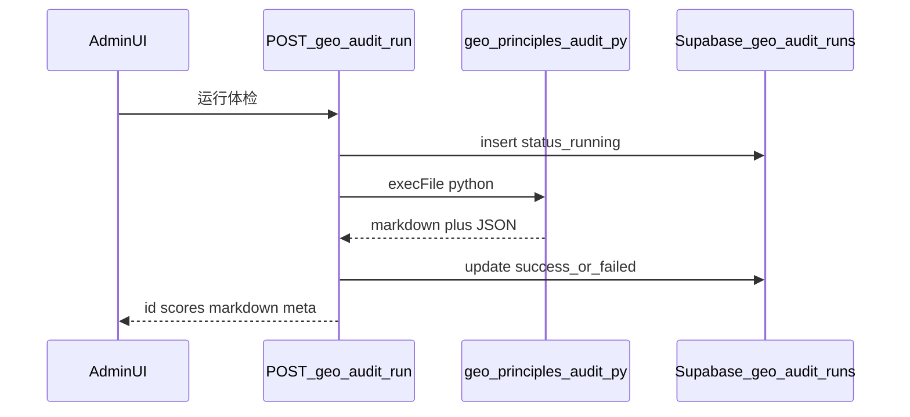

# GEO 体检后台极简重构计划

## 现状摘要（与目标的差距）

- **页面**：仅有 [`src/app/[locale]/admin/login/page.tsx`](src/app/[locale]/admin/login/page.tsx) 与 [`src/app/[locale]/admin/geo/page.tsx`](src/app/[locale]/admin/geo/page.tsx)；登录后跳转 `/admin/geo`（next-intl 下实际为 `/{locale}/admin/geo`）。
- **API**：[`src/app/api/admin/geo/principles-audit/route.ts`](src/app/api/admin/geo/principles-audit/route.ts) 校验 Cookie 后调用 [`src/lib/geo-principles-audit-runner.ts`](src/lib/geo-principles-audit-runner.ts) 执行 [`scripts/geo_principles_audit.py`](scripts/geo_principles_audit.py)；**未写入数据库、无历史接口**。
- **前端展示**：[`src/components/admin/GeoAuditRunner.tsx`](src/components/admin/GeoAuditRunner.tsx) 用 `<pre>` 展示 Markdown，**未做 Markdown 渲染**；无「历史记录」入口。
- **脚本输出**：Python 已输出五维分数键名（如 `可召回 Retrievability`）、启发式说明与规则建议；与用户文档第 6 节要求的「每项：符合点 / 短板 / 加强 / 建议」结构仍有差距；LLM 目前仅通过 `geo_audit_paste_to_llm_zh.txt` **人工**流程，未在脚本内调用 API。
- **容器**：[`Dockerfile`](Dockerfile) 已安装 `python3` 并复制 `scripts/content/src/docs`，满足服务端跑脚本的前提。
- **勿误删**：[`src/lib/geo-rules.ts`](src/lib/geo-rules.ts)、[`src/lib/geo-settings.ts`](src/lib/geo-settings.ts) 仍被前台 [`guides`](src/app/[locale]/guides) 与 layout 使用；**首期只删后台专属死代码**，不删除 `geo_rules` 等业务表。

**路径说明**：规格中的 `/admin/...` 在工程里应通过 **next-intl 无 locale 前缀的路径**（`router.push("/admin/geo-audit")`）实现，浏览器地址栏仍为 `/{locale}/admin/geo-audit/...`，与现有 [`AdminLoginForm`](src/components/admin/AdminLoginForm.tsx) 写法一致。

---

## 架构与数据流（首期同步 HTTP）

- 首期保持 **单次请求内跑完脚本**（与现 [`runGeoPrinciplesAuditScript`](src/lib/geo-principles-audit-runner.ts) 的 `timeout: 90_000` 一致），用 DB 行表达 `running → success|failed`，避免仅靠前端 state 丢历史。

---

## 阶段 1：路由与命名对齐（删旧路径、改跳转）

| 动作 | 说明 |
|------|------|
| 新建页面树 | `src/app/[locale]/admin/geo-audit/page.tsx`（主页）、`.../geo-audit/history/page.tsx`、`.../geo-audit/history/[id]/page.tsx`；可加 [`layout.tsx`](src/app/[locale]/admin/geo-audit/layout.tsx) 统一 Header（标题「GEO 体检后台」、`历史记录` 链接、`退出登录`）。 |
| 删除旧页 | 删除 `admin/geo/page.tsx`；在旧 URL 上可做 **永久 redirect** 到 `/admin/geo-audit`（可选，利于书签）。 |
| 更新跳转 | [`AdminLoginForm`](src/components/admin/AdminLoginForm.tsx)、[`admin/login/page.tsx`](src/app/[locale]/admin/login/page.tsx) 中已登录 redirect 均改为 `/admin/geo-audit`。 |
| 清理 API 路径 | 删除 `api/admin/geo/principles-audit/route.ts`，新增下文 API 文件（真正删除而非保留别名，除非你明确要求短期兼容）。 |

---

## 阶段 2：数据库 `geo_audit_runs`

- 新增迁移：[`supabase/migrations/`](supabase/migrations/) 下建表 `geo_audit_runs`，字段对齐你方规格（`id`、`status`、`started_at`、`finished_at`、五项分数列、`report_markdown`、`report_json`、`error_message`、`used_llm`、`llm_model`、`script_version`、`target_path`、`created_by` 可空）。
- **RLS**：与现有 [`004_geo_ops_phase3.sql`](supabase/migrations/004_geo_ops_phase3.sql) 类似，仅 `service_role` 全权限；应用侧一律用 [`getServiceSupabase()`](src/lib/supabase.ts) 读写（与当前其它服务端写库方式一致）。
- 新增小型数据访问层：例如 `src/lib/geo-audit-runs.ts`（`createRun`、`updateRun`、`listRuns`、`getRun`），避免在 route 里堆 SQL 字段名。

**环境变量**：在 [`.env.example`](.env.example) 中补充说明；部署需 `SUPABASE_SERVICE_ROLE_KEY`（写入历史已具备条件）。

---

## 阶段 3：后端 API（与你方 §9 对齐）

在 `src/app/api/admin/geo-audit/` 下实现（均先校验 Cookie，复用 [`verifyAdminSession`](src/lib/admin-session.ts) + 限流模式参考现 [`principles-audit/route.ts`](src/app/api/admin/geo/principles-audit/route.ts)）：

1. **`POST /api/admin/geo-audit/run`**  
   - 插入 `running` 行 → 调用现有 `runGeoPrinciplesAuditScript()`（可抽成内部函数供测试 mock）→ 根据 `ok` / 解析出的 JSON 分数更新行 → 返回 `id`、`status`、分数、`markdown`、`used_llm`、`llm_model` 等。  
   - 失败时仍尽量保存已截断的 `stdout` markdown、`stderr` 到 `error_message`/`report_markdown` 字段策略需在实现时定一条简单规则（例如 stderr 写入 `error_message`，stdout 有则写入 `report_markdown`）。

2. **`GET /api/admin/geo-audit/history`**  
   - 分页可选（首期可 `limit` 固定如 50）；列表字段含五项分数、摘要（从 markdown 首段截取或从 JSON 派生）、`used_llm`。

3. **`GET /api/admin/geo-audit/history/[id]`**  
   - 返回完整元信息 + `report_markdown` + 可选 `report_json`（默认 JSON 给前端但 UI 可不展示）。

**类型与安全**：对入库 JSON 做合理大小限制（防止异常大 payload 撑爆 DB）。

---

## 阶段 4：前端（Markdown 渲染 + 历史）

- **依赖**：增加 `react-markdown` + `remark-gfm`（表格/GFM），配合已有 `@tailwindcss/typography` 的 `prose` 类渲染报告区；原始 Markdown 用 `
` 或可切换 Tab 保留，满足「同时保留原文」。
- **主页**：将 [`GeoAuditRunner`](src/components/admin/GeoAuditRunner.tsx) 重构或替换为面向新 API 的组件：状态「未运行 / 运行中 / 成功 / 失败」；成功区展示渲染后的 MD；失败展示 `error_message` 与是否有一部分 `markdown`。
- **历史列表页**：表格或简洁卡片列表，点击进详情。
- **详情页**：服务端取数（`params.id`）或客户端 fetch；Markdown 渲染与主页一致。
- **退出登录**：Header 内调用现有 [`/api/admin/logout`](src/app/api/admin/logout/route.ts) 后跳转登录页（逻辑可从 `GeoAuditRunner` 上移到 layout 内共享组件）。

实现 Next 16 App Router 细节前，按仓库规则阅读 `node_modules/next/dist/docs/` 中与 Route Handlers、动态段相关的说明，避免沿用过时写法。

---

## 阶段 5：Python 脚本与 LLM（`chatgpt-5.4-mini`）

- **报告结构**：扩展 [`build_report`](scripts/geo_principles_audit.py)（及 JSON 中的结构化块），使 Markdown **显式包含**：总览、五项（分数 + 符合点 + 短板 + 需加强 + 修改建议）、P0/P1/P2 建议汇总、以及你要求的 **启发式免责声明**（可与现有「脚本无法替代」段落合并表述）。规则扫描结果仍为主体。
- **LLM**：在脚本内增加可选路径（例如环境变量 `GEO_AUDIT_USE_LLM=1` 且存在 `OPENAI_API_KEY` 时）：将 **facts + scores + 规则要点** 作为输入，调用 OpenAI HTTP API；**模型名**使用环境变量（默认 `chatgpt-5.4-mini`），实现时核对官方当前模型标识并在注释/README 说明。LLM 输出附录或「润色章节」拼入最终 Markdown；在 JSON 中设 `used_llm` / `llm_model` / `script_version`（可用常量或 git describe 简化）。  
- **CI/测试**：无 key 时行为与现网一致（纯规则）；集成测试继续可用 `GEO_AUDIT_SKIP=1` 或 mock 子进程。

---

## 阶段 6：死代码删除与文档/测试

| 项 | 说明 |
|----|------|
| 删除 [`src/lib/geo-ops.ts`](src/lib/geo-ops.ts) | `src` 内已无 import；仅 [`tests/unit/geo-ops.test.ts`](tests/unit/geo-ops.test.ts) 引用——删除该测试或改为测仍需要的纯函数（若全部删除则移除测试文件）。 |
| 精简 [`src/lib/geo-rules.ts`](src/lib/geo-rules.ts) | `writeGeoRuleLog` / `listGeoRuleLogs` / `GeoRuleLogRow` 已无引用，可删除，减少「旧后台」痕迹。 |
| 测试 | 新增 integration：`POST /api/admin/geo-audit/run`（mock DB 或 test Supabase 视项目惯例）、`GET history`；更新 e2e（若有硬编码旧路径）。 |
| 文档 | 更新 [`docs/geo-backend-operation-guide.md`](docs/geo-backend-operation-guide.md) 中的路径描述；README 增补新 env（`OPENAI_API_KEY`、`GEO_AUDIT_USE_LLM`、可选模型名）与后台入口 URL 说明。 |

---

## 验收对照（你方 §13）

- 登录 → 仅进入 **GEO 体检主页**（新路径）；Header 含 **历史记录**、**退出登录**；主按钮 **运行 GEO 体检**；运行态清晰；报告 **Markdown 渲染** + 原文可查；历史列表 + 详情可打开；旧 `/admin/geo` 与旧 API **文件级删除**（或 redirect 后无独立功能页）。  
- 报告含五项分数、加强项与建议、启发式声明；元数据中带 **是否使用 LLM**（若未启用则为 `false`）。

---

## 风险与注意点

- **模型名**：`chatgpt-5.4-mini` 以实现当日 OpenAI 文档为准；务必可配置。  
- **大报告体积**：注意 DB 列类型（`text`）与响应体大小。  
- **不要在首期删除** `geo_rules` / `geo_page_schema_toggles` 等表：前台仍依赖；若未来整站不再用，再单独立项做数据迁移。
