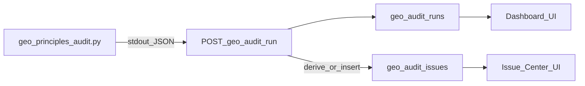

# GEO 体检后台 → GEO 质量治理决策台（实施计划）

## 现状对齐（仓库内已具备）

- **鉴权与布局**：[`src/app/[locale]/admin/geo-audit/layout.tsx`](src/app/[locale]/admin/geo-audit/layout.tsx) 校验 cookie；[`src/components/admin/GeoAuditHeader.tsx`](src/components/admin/GeoAuditHeader.tsx) 仅「主页 / 历史」。
- **运行链路**：[`src/app/api/admin/geo-audit/run/route.ts`](src/app/api/admin/geo-audit/run/route.ts) 调用 [`src/lib/geo-principles-audit-runner.ts`](src/lib/geo-principles-audit-runner.ts) 执行 `scripts/geo_principles_audit.py --json`，写入 [`src/lib/geo-audit-runs.ts`](src/lib/geo-audit-runs.ts) 对应的 [`supabase/migrations/005_geo_audit_runs.sql`](supabase/migrations/005_geo_audit_runs.sql) 表（含 `report_markdown`、`report_json`）。
- **JSON 形态**：Python 在 `--json` 下输出 `scores`、`facts`（[`scripts/geo_principles_audit.py`](scripts/geo_principles_audit.py) 中 `AuditFacts` + `content_signals` 聚合），**尚无**一等公民的 `issues[]`；TS 侧 [`PrinciplesAuditJson`](src/lib/geo-principles-audit-runner.ts) 也尚未声明 issues。
- **展示**：历史列表用 [`summaryFromMarkdown`](src/lib/geo-audit-scores.ts)；详情页 [`src/app/[locale]/admin/geo-audit/history/[id]/page.tsx`](src/app/[locale]/admin/geo-audit/history/[id]/page.tsx) **未消费** `report_json`，仅 Markdown。
- **登录落地**：[`src/app/[locale]/admin/login/page.tsx`](src/app/[locale]/admin/login/page.tsx) 与 [`AdminLoginForm`](src/components/admin/AdminLoginForm.tsx) 成功后跳转到 `/admin/geo-audit`（当前即 Runner 页）。
- **注意**：[`supabase/migrations/004_geo_ops_phase3.sql`](supabase/migrations/004_geo_ops_phase3.sql) 中的 `geo_audit_logs` 是运营/发布动作审计日志，与 `geo_audit_runs` 不同；后续「治理动作留痕」可评估复用 `action`/`resource_key` 语义或新建专用表，避免概念混淆。

## 总体技术路线（与你的原则一致）

- **单一真相源**：规则扫描结论仍以 Python `facts`/`scores` 为主；**结构化问题**优先由脚本输出稳定 `issues[]`（带 `code`、严重度、层级、证据字段），避免仅靠 Markdown 正则拆解。
- **服务端落库**：体检完成后在 Node（[`run/route.ts`](src/app/api/admin/geo-audit/run/route.ts)）或共享 TS 模块中 **幂等写入** `geo_audit_issues`（同一 `run_id` 重跑策略需定义：通常「每次 run 新建一批 issue 行」即可）。
- **UI 先骨架后精雕**：Phase 1 以表格/卡片 + 枚举筛选为主，少自由文本；复杂富文本编辑明确不做。
- **双语/页面级**：当前 `count_mdx_signals` 只有计数；要向「问题中心」提供**页面列表**，需在 Python 侧扩展扫描（返回缺失 frontmatter/标题等的 `paths[]`），或 Phase 1 先只做站点/模板级 issue，页面级后续迭代。

## Phase 1（P0）：后台定位 + 结构化拆解骨架

**目标**：登录后进「总览台」；单次体检可看分数摘要 + 结构化问题列表；历史可感知问题分布；保留现有「运行体检」能力。

1. **路由与信息架构（仍在 `admin/geo-audit` 下演进）**
   - 将默认首页改为 **总览台**（新页面，例如 [`src/app/[locale]/admin/geo-audit/page.tsx`](src/app/[locale]/admin/geo-audit/page.tsx) 替换为 Dashboard，或新增子路径后把原 Runner 挪走）。
   - 将现有 Runner 挪至 **`/admin/geo-audit/run`**（与文档「运行体检为流程入口」一致）。
   - 更新 [`GeoAuditHeader`](src/components/admin/GeoAuditHeader.tsx)：主导航为「总览 / 运行体检 / 问题（初版）/ 历史」，其余模块（决策/验证/标准）可先占位链接或 Phase 2 再加，避免空路由过多。
   - 更新登录成功跳转：[`admin/login/page.tsx`](src/app/[locale]/admin/login/page.tsx)、[`AdminLoginForm`](src/components/admin/AdminLoginForm.tsx)、[`admin/geo/page.tsx`](src/app/[locale]/admin/geo/page.tsx) 重定向目标改为总览路径。

2. **数据模型：`geo_audit_issues`（新 migration）**
   - 建议最小字段：`id`、`run_id`（FK `geo_audit_runs`）、`code`（稳定枚举，如 `SITEMAP_FAKE_LASTMOD`）、`title`、`severity`、`layer`（`site` | `template` | `page` | `locale_pair`）、`status`（`open` | `superseded` | …）、`facts_snapshot`（jsonb，可选）、`evidence`（jsonb：文件路径、计数、样例 URL）、`created_at`。
   - 索引：`(run_id)`、`(code, status)`、`(severity)`。

3. **报告 → 问题拆解（实现优先级）**
   - **3a（推荐先做）**：在 [`scripts/geo_principles_audit.py`](scripts/geo_principles_audit.py) 增加 `build_issues(facts, scores) -> list[dict]`，写入 JSON 根级的 `issues`（与 `scores`/`facts` 并列）；issue 生成规则与现有 P0/P1 列表同源，保证**可回溯到规则 code**。
   - **3b**：新增 TS 模块（例如 `src/lib/geo-audit-issues.ts`）负责校验/归一化 issues、并在 [`run/route.ts`](src/app/api/admin/geo-audit/run/route.ts) 完成 `updateGeoAuditRun` 后批量 `insert` issues（若未配置 DB 则跳过，与现有一致）。
   - **3c**：扩展 [`PrinciplesAuditJson`](src/lib/geo-principles-audit-runner.ts) 类型；可选在「无 DB」场景仍把 `issues` 随 API JSON 返回给前端展示。

4. **页面改造**
   - **总览台**：读取最近一次 `success` run + 可选对比上一次；展示五维分数、`issues` 按 `severity`/`layer` 聚合计数、待办数量（`status=open`）；链接到「运行体检」「问题列表」「最近一次详情」。
   - **单次体检详情**：[`history/[id]/page.tsx`](src/app/[locale]/admin/geo-audit/history/[id]/page.tsx) 增加「分数摘要」「结构化问题」区块（读 DB `geo_audit_issues` 或 fallback `report_json.issues`）；Markdown 可保留在折叠区。
   - **历史列表**：[`history/page.tsx`](src/app/[locale]/admin/geo-audit/history/page.tsx) / [`api/.../history/route.ts`](src/app/api/admin/geo-audit/history/route.ts) 增加每 run 的 `issue_open_count`（轻量聚合查询或列表接口扩展字段）。

5. **测试**
   - 扩展 [`tests/integration/geo-audit-admin.route.test.ts`](tests/integration/geo-audit-admin.route.test.ts)：在 mock `GEO_AUDIT_SKIP` 的 JSON 中注入假 `issues`，断言 API/DB 路径行为（无 DB 时不崩）。

## Phase 2：问题中心 + 决策中心（P0/P1）

- **问题中心**：筛选（`code`、`severity`、`layer`、`run_id`）、详情页展示 `evidence`、关联的 `AuditRun` 元数据。
- **自动归因**：在 issue 上增加 `attribution` 字段（枚举 + 简短说明），由 Python 或 TS 规则表根据 `code` 映射。
- **`DecisionProposal` / `DecisionRecord`**：新表或在 `geo_audit_issues` 上增加 `proposals_json`（短期）+ `decision_json`（人工选择结果）；API `POST` 仅接受枚举选项（禁止大段自由文本）。
- **`RemediationTask`**：决策后生成任务行（`pending`/`done`/`blocked`），先以「导出说明 + 仓库内应改文件清单」为主，自动改稿不在范围。

**页面级 / 双语**（与你文档 4.6、4.3 对齐）：扩展 Python `iter_mdx` 扫描，产出带 `locale` + `path` 的 issues（例如缺 `tldr` 的文件列表，限制最大条数写入 `evidence`）；中日配对需约定 slug 对应规则后再做 `ContentPair` 级校验。

## Phase 3：验证与复检闭环（P1/P2）

- 新表：`validation_checks`（勾选式清单项、结果枚举、`issue_id` 关联）、`recheck_runs`（指向新/旧 `run_id`）。
- UI：从 issue/task 一键触发「复检」（复用现有 `POST /api/admin/geo-audit/run`），对比页读取两次 run 的分数与 issues diff（按 `code` 聚合）。

## Phase 4：标准中心 + 长期治理（P2）

- `TemplateRuleProfile` 等：建议以 **版本化 JSON/YAML 快照** 存表或存仓库 `docs/` 并由后台只读展示 + 校验开关；发布前校验可作为 CI 或 `npm run` 脚本入口，与后台「标准中心」读同一规则源。

## 风险与取舍（实施时需写进 PR 说明）

- **`report_json` 体积**：已有 [`truncateReportJson`](src/lib/geo-audit-runs.ts)；`issues` 若含大量路径需截断或只存统计 + 抽样路径。
- **Windows/编码**：脚本已处理 UTF-8；新增 JSON 字段保持 ASCII 安全转义即可。
- **Next 版本差异**：改动前阅读 [`node_modules/next/dist/docs/`](node_modules/next/dist/docs/) 中与 App Router、Server Actions（若采用）相关的当前项目约定（工作区规则要求）。

## 建议的验收清单（Phase 1）

- 登录后进入 **总览台**（非 Runner）。
- 运行体检后，DB 中该 `run` 下存在 **多行 `geo_audit_issues`**，且与 JSON `issues` 一致。
- 历史详情页除 Markdown 外可看到 **结构化问题列表**。
- 未配置 `DATABASE_URL` 时行为与现状兼容（不持久化 issue，但可在 API 响应中返回 `issues` 供前端展示——若实现成本低可做）。
