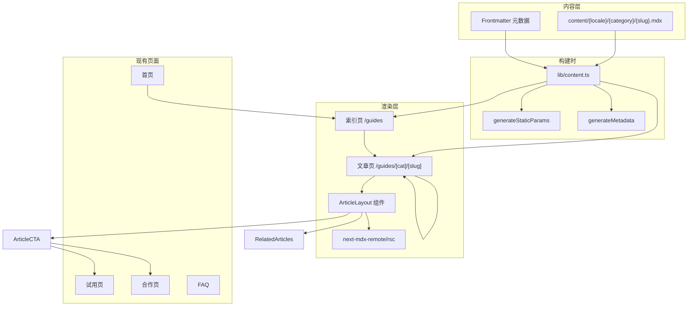

# GEO 网站阶段 2 实施计划

## 现状总结

阶段 1 已交付：首页、免费试用页、机构合作页、FAQ 页，支持中日双语（next-intl），Supabase 表单 + 自建埋点，Docker 自托管部署。所有页面文案存放在 `src/messages/zh.json` 和 `ja.json` 中。

**核心技术栈：** Next.js 16 (App Router) + React 19 + Tailwind CSS 4 + next-intl + Supabase + Zod

**阶段 2 核心变化：** 从纯入口页面扩展到长篇结构化内容页，需要引入 MDX 内容管线。

---

## 架构决策

### 内容管理：MDX + frontmatter（轻量本地方案）

不上 CMS，使用本地 MDX 文件 + frontmatter 元数据。选择 `next-mdx-remote` + `gray-matter` 处理 MDX，原因：

- 符合规范要求的"md / mdx / 本地内容文件 + 简单 frontmatter"
- 长篇结构化内容用 MDX 比 JSON 更自然、更易维护
- UI 级文案（导航、CTA 按钮文字等）继续走 `messages/*.json`
- 不需要引入 Contentlayer/Velite 等重依赖

**新增依赖：** `next-mdx-remote`, `gray-matter`, `reading-time`（可选）

### 内容目录结构

```
content/
├── zh/
│   ├── problems/
│   │   ├── resume-vs-japanese.mdx
│   │   ├── job-seeking-vs-language.mdx
│   │   ├── resume-writing-not-just-writing.mdx
│   │   ├── goal-unclear-kills-consulting.mdx
│   │   └── when-not-to-apply.mdx
│   ├── paths/
│   │   ├── four-preparation-paths.mdx
│   │   ├── parallel-japanese-and-job.mdx
│   │   └── push-forward-or-sort-first.mdx
│   ├── boundaries/
│   │   ├── when-to-use-hope-sorting.mdx
│   │   └── what-we-dont-handle-yet.mdx
│   └── cases/
│       ├── direction-unclear-sorted.mdx
│       ├── should-learn-japanese-first.mdx
│       └── sort-goal-before-resume.mdx
├── ja/
│   └── (镜像结构，日文版本)
```

### Frontmatter Schema（所有文章统一）

```yaml
---
title: "在日本找工作，应该先改简历还是先补日语？"
description: "很多人以为找工作第一步是改简历..."
category: "problems"       # problems | paths | boundaries | cases
slug: "resume-vs-japanese"
publishedAt: "2026-04-20"
updatedAt: "2026-04-20"
suitableFor:               # 适合谁（可选，边界页/问题页推荐）
  - "方向不清但想推进的人"
notSuitableFor:            # 不适合谁（可选）
  - "已有明确方向只需执行的人"
relatedSlugs:              # 关联文章 slug（用于内链和相关推荐）
  - "paths/four-preparation-paths"
  - "boundaries/when-to-use-hope-sorting"
ctaType: "trial"           # 主 CTA 类型：trial | partner | both
---
```

### URL 结构

```
/zh/guides                              → 内容索引页
/zh/guides/problems/resume-vs-japanese  → 问题页
/zh/guides/paths/four-preparation-paths → 路径页
/zh/guides/boundaries/when-to-use-hope-sorting → 边界页
/zh/guides/cases/direction-unclear-sorted → 案例页
```

### 路由文件结构

```
src/app/[locale]/guides/
├── page.tsx                              # 内容索引页
└── [category]/
    └── [slug]/
        └── page.tsx                      # 文章详情页（动态路由）
```

---

## 内容加载工具（`src/lib/content.ts`）

核心工具函数，负责读取和解析 MDX 文件：

- `getArticleBySlug(locale, category, slug)` — 读取单篇文章的 MDX + frontmatter
- `getArticlesByCategory(locale, category)` — 获取某分类下所有文章的元信息列表
- `getAllArticles(locale)` — 获取全部文章元信息（用于索引页和 sitemap）
- `getRelatedArticles(locale, relatedSlugs)` — 根据 relatedSlugs 获取关联文章

所有函数在服务端调用（RSC），使用 `fs.readFileSync` + `gray-matter` 解析 frontmatter，`next-mdx-remote/rsc` 编译 MDX。

---

## 新增组件清单

### 文章布局组件 — `src/components/article/ArticleLayout.tsx`

统一的文章页外壳，包含：
- 面包屑导航
- H1 标题
- 文章元信息（发布日期、分类标签）
- MDX 正文渲染区（应用 `@tailwindcss/typography` 的 `prose` 样式）
- 文章级 CTA 区块（页尾固定）
- 相关文章推荐区块

### 面包屑 — `src/components/article/Breadcrumb.tsx`

示例：首页 > 路径判断 > 问题页 > 当前文章标题

### 文章目录 — `src/components/article/TableOfContents.tsx`

从 MDX 内容中提取 H2/H3 生成侧边或顶部目录（篇幅较长时显示）。

### 文章级 CTA — `src/components/article/ArticleCTA.tsx`

根据 frontmatter 中的 `ctaType` 渲染不同 CTA：
- `trial` → 引导到免费试用 / 开始希望整理
- `partner` → 引导到机构合作
- `both` → 双按钮
- 中段可选插入一次轻量 CTA（不打断阅读）
- 页尾固定一次完整 CTA 区块

### 相关文章 — `src/components/article/RelatedArticles.tsx`

根据 frontmatter `relatedSlugs` 渲染 2-4 篇相关文章卡片链接。

### 适合/不适合区块 — `src/components/article/AudienceBlock.tsx`

复用 [AudienceSection](src/components/home/AudienceSection.tsx) 的视觉风格，但数据来自 frontmatter `suitableFor` / `notSuitableFor` 字段。

### 内容索引页卡片 — `src/components/article/ArticleCard.tsx`

用于索引页，展示文章标题 + 描述 + 分类标签 + 链接。

### MDX 自定义组件 — `src/components/article/mdx-components.tsx`

为 MDX 内容提供自定义渲染组件（如自定义 `<Callout>`、`<StepList>`），确保文章内可使用结构化展示。

---

## 页面开发清单

### 1. 内容索引页 — `/guides`

- 顶部标题 + 简介
- 按分类分组展示所有文章（问题页 / 路径页 / 边界页 / 案例页）
- 每篇文章显示为卡片（标题 + 描述摘要 + 链接）
- 此页面作为导航入口挂载到 Header

### 2. 文章详情页 — `/guides/[category]/[slug]`

- 使用 `generateStaticParams` 静态生成所有文章页面（SSG）
- 使用 `generateMetadata` 为每篇文章生成独立的 title / description / OG / alternates
- 加入 `Article` JSON-LD 结构化数据
- 调用 `ArticleLayout` 渲染

### 3. 首批内容页（8-12 篇）

**问题页（5 篇）：**
1. 在日本找工作，应该先改简历还是先补日语？
2. 不知道该先求职还是先学语言的人，应该怎么判断？
3. 職務経歴書写不好，问题通常不只是写作
4. 为什么很多咨询其实死在"目标没说清楚"这一步？
5. 什么情况下不适合立刻投简历，而适合先整理方向？

**路径页（3 篇）：**
1. 在日本发展的 4 条常见准备路径
2. 日语学习和求职准备，怎么并行才不容易空转？
3. 哪类情况适合直接推进，哪类情况适合先整理？

**边界页（2 篇）：**
1. 什么问题适合先做希望整理？
2. 什么问题现在还不适合通过这个网站处理？

**案例页（2 篇）：**
1. 一个"方向不清"的案例，是怎么被整理出来的？
2. 一个"其实该先补日语"的案例，是怎么判断出来的？

---

## 导航与信息架构调整

### Header 更新 — [src/components/layout/Header.tsx](src/components/layout/Header.tsx)

在现有导航项中新增"路径判断"入口：

```
首页 | 免费试用 | 机构合作 | 路径判断(新) | 常见问题
```

对应 `navItems` 新增 `{ key: "guides", href: "/guides" }`，`messages/*.json` 的 `common.nav` 新增 `guides` 键。

### Footer 更新 — [src/components/layout/Footer.tsx](src/components/layout/Footer.tsx)

在链接区新增"路径判断"链接。

### 首页更新 — [src/app/[locale]/page.tsx](src/app/[locale]/page.tsx)

在底部 CTA 区域上方新增一个"核心内容推荐"区块，链接到 2-3 篇最重要的路径页/问题页。

---

## 内链策略实现

- 每篇文章 frontmatter 中的 `relatedSlugs` 驱动页尾"相关文章"推荐
- MDX 正文中可直接使用 `[链接文字](/guides/paths/xxx)` 进行内链
- 首页链向核心路径页和免费试用页
- 问题页链向相关路径页 + 边界页 + 试用页
- 路径页链向相关问题页 + 案例页 + 试用页
- 边界页链向试用页 + 合作页 + FAQ
- 案例页链向相关路径页 + 边界页 + 试用页

---

## SEO / GEO 增强

### 每篇文章 Metadata

通过 `generateMetadata` 自动从 frontmatter 生成：
- `title`: frontmatter.title + " | GEO"
- `description`: frontmatter.description
- `openGraph`: title / description / locale / type:"article"
- `alternates`: 中日双语 hreflang
- `canonical`: 当前页面 URL

### JSON-LD 结构化数据

为每篇文章添加 `Article` JSON-LD：
- `@type`: "Article"
- `headline`: frontmatter.title
- `description`: frontmatter.description
- `datePublished` / `dateModified`
- `author`: Organization

### Sitemap 更新 — [src/app/sitemap.ts](src/app/sitemap.ts)

扩展 sitemap 生成逻辑，自动包含所有 `content/` 目录下的文章页面 URL，包括中日双语版本。

### robots.txt

保持现有配置即可，确保 `/guides/` 路径可被爬取。

---

## 埋点增强

在 `messages/*.json` 中新增文章页相关的埋点事件名，在 `TrackingProvider` 或文章组件中新增：

- `article_view` — 文章页浏览（含 category 和 slug）
- `article_cta_click` — 文章内 CTA 点击（含 ctaId、文章 slug）
- `article_related_click` — 相关文章点击
- `article_scroll_depth` — 页面滚动深度（25% / 50% / 75% / 100%）

这些事件继续写入 Supabase `tracking_events` 表，无需改表结构。

---

## i18n 文案更新

### `src/messages/zh.json` 新增

```json
{
  "common": {
    "nav": {
      "guides": "路径判断"
    }
  },
  "guides": {
    "title": "路径判断与问题解答",
    "subtitle": "帮你整理方向、理解判断逻辑、找到合理的下一步",
    "categories": {
      "problems": "问题解答",
      "paths": "路径判断",
      "boundaries": "边界说明",
      "cases": "真实案例"
    },
    "readMore": "阅读详情",
    "relatedArticles": "相关文章",
    "publishedAt": "发布于",
    "backToGuides": "返回路径判断",
    "articleCta": {
      "title": "想整理一下你的情况？",
      "subtitle": "不需要一次想清楚，先把现状说出来就好"
    }
  },
  "metadata": {
    "guides": {
      "title": "路径判断与问题解答 | GEO",
      "description": "帮助在日本发展的人整理方向、判断路径、理解边界。"
    }
  }
}
```

`ja.json` 同步新增日文翻译。

---

## 数据流全景



---

## 实施顺序

实施分 6 个批次，按依赖关系推进：

**批次 1：MDX 基础设施**
- 安装依赖（next-mdx-remote, gray-matter）
- 创建 `src/lib/content.ts` 工具函数
- 创建 content 目录结构
- 定义 frontmatter TypeScript 类型

**批次 2：文章组件**
- ArticleLayout / Breadcrumb / TableOfContents
- ArticleCTA / RelatedArticles / AudienceBlock
- ArticleCard / mdx-components

**批次 3：页面路由**
- 内容索引页 `/guides`
- 文章详情页 `/guides/[category]/[slug]`
- generateStaticParams + generateMetadata

**批次 4：导航与架构更新**
- Header 新增导航项
- Footer 新增链接
- 首页新增内容推荐区块
- messages JSON 文案更新（中日双语）

**批次 5：内容写作**
- 首批 12 篇文章 MDX（5 问题 + 3 路径 + 2 边界 + 2 案例）
- 中文版优先，日文版跟进
- 确保 frontmatter 内链配置完整

**批次 6：SEO / 埋点 / 收尾**
- 文章 JSON-LD
- Sitemap 扩展
- 文章埋点事件接入
- 移动端适配检查
- 内链验证
- 全站测试
