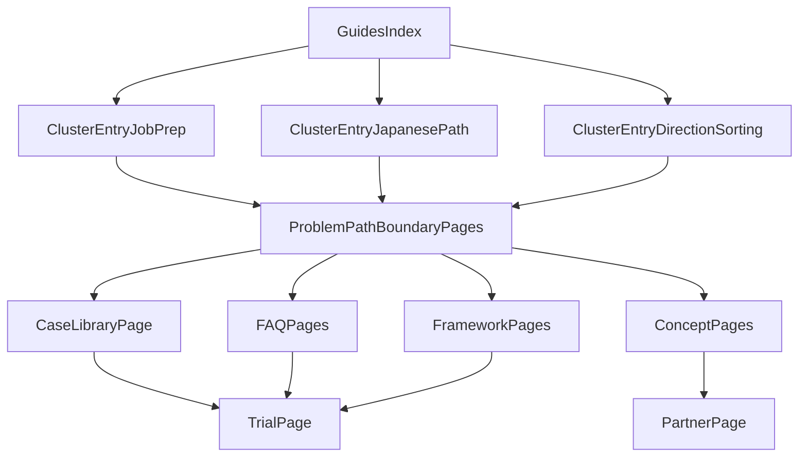

# GEO网站阶段3（MVP）实施计划

## 目标与范围（按你选择的MVP）

在不做重型CMS改造的前提下，利用现有 `content + frontmatter + App Router` 体系，先上线一套“可沉淀、可内链、可转化、可观测”的最小集合：

- `3` 个主题簇入口页（先不一次做满4个）
- `1` 个案例库总览页
- `3` 个专题 FAQ 页
- `2` 个判断框架页
- `2` 个概念页
- 对阶段2核心内容完成一轮内链升级与CTA优化

## 现状基线（已具备能力）

- 内容系统已可承载扩展：[`/Users/palm/PycharmProjects/kibouFlow/content`]( /Users/palm/PycharmProjects/kibouFlow/content ) + [`/Users/palm/PycharmProjects/kibouFlow/src/lib/content.ts`]( /Users/palm/PycharmProjects/kibouFlow/src/lib/content.ts )
- 现有分类固定为 `problems/paths/boundaries/cases`，文章页支持 metadata、JSON-LD、相关推荐
- 已有埋点与表单闭环：[`/Users/palm/PycharmProjects/kibouFlow/src/lib/tracking.ts`]( /Users/palm/PycharmProjects/kibouFlow/src/lib/tracking.ts )、[`/Users/palm/PycharmProjects/kibouFlow/src/app/api/track/route.ts`]( /Users/palm/PycharmProjects/kibouFlow/src/app/api/track/route.ts )、trial/partner 表单 API

## MVP 信息架构（阶段3最小站点骨架）

- 入口层：`/guides`（内容总索引）+ 3个主题簇入口页
- 资产层：案例库总览 + FAQ专题 + 框架页 + 概念页
- 转化层：统一 CTA（trial/partner）+ 每页“下一步建议”
- 连接层：related content + 簇内互链 + 簇到表单路径

## 实施阶段

### 阶段A：内容模型最小扩展（先打地基）

- 扩展 frontmatter 字段（兼容旧文，不破坏现有渲染）
  - 建议新增：`contentType`、`cluster`、`audience`、`ctaType`、`relatedSlugs`、`updatedAt`
  - 位置：[`/Users/palm/PycharmProjects/kibouFlow/src/lib/content.ts`]( /Users/palm/PycharmProjects/kibouFlow/src/lib/content.ts )
- 确定 `contentType` 枚举：`problem/path/boundary/case/faq/framework/concept/cluster`
- 保留当前目录形态（不做大迁移），先通过 frontmatter 驱动分组与索引

### 阶段B：新增MVP页面（先结构后规模）

- 主题簇入口页（3页，优先你已验证问题域）
- 案例库页（1页，按“问题类型”分类浏览）
- FAQ 专题页（3页）
- 判断框架页（2页）
- 概念页（2页）
- 路由与页面组织建议优先复用现有 `guides` 体系：[`/Users/palm/PycharmProjects/kibouFlow/src/app/[locale]/guides`]( /Users/palm/PycharmProjects/kibouFlow/src/app/[locale]/guides )

### 阶段C：旧内容升级（阶段2资产再组织）

- 对核心 `problems/paths/boundaries/cases` 文章补齐：
  - 适合谁 / 不适合谁
  - 下一步建议
  - 相关 FAQ / 框架 / 概念 / 案例链接
- 重点文件：[`/Users/palm/PycharmProjects/kibouFlow/src/components/article/ArticleLayout.tsx`]( /Users/palm/PycharmProjects/kibouFlow/src/components/article/ArticleLayout.tsx ) 与对应 MDX 内容

### 阶段D：内链与转化优化（形成闭环）

- 首页与 `guides` 增加主题簇入口曝光
- 主题簇页 -> 对应问题/路径/边界/案例/FAQ
- 文章页中段与页尾 CTA 做文案与位置微调（不激进改版）
- 相关组件：[`/Users/palm/PycharmProjects/kibouFlow/src/components/layout/CTAButtons.tsx`]( /Users/palm/PycharmProjects/kibouFlow/src/components/layout/CTAButtons.tsx )、[`/Users/palm/PycharmProjects/kibouFlow/src/components/article/ArticleCTA.tsx`]( /Users/palm/PycharmProjects/kibouFlow/src/components/article/ArticleCTA.tsx )

### 阶段E：观测与验收（用数据决定下一轮）

- 事件维度补充：cluster入口点击、案例库到trial点击、FAQ到trial/partner点击
- 看板问题：
  - 哪个簇成为长期入口
  - 哪类内容带来更高表单启动率
  - 哪个 CTA 文案组合最有效
- 埋点扩展位置：[`/Users/palm/PycharmProjects/kibouFlow/src/lib/tracking.ts`]( /Users/palm/PycharmProjects/kibouFlow/src/lib/tracking.ts ) 与调用点

## MVP 页面清单（建议上线顺序）

1. 主题簇入口：求职准备怎么整理
2. 主题簇入口：日语学习路径怎么判断
3. 主题簇入口：方向不清时怎么先做希望整理
4. 案例库总览页
5. 求职准备 FAQ
6. 日语学习路径 FAQ
7. 机构合作 FAQ
8. 框架页：先补日语还是先求职
9. 框架页：哪些信号不适合直接推进
10. 概念页：什么是希望整理
11. 概念页：什么是路径判断

## Definition of Done（MVP版）

- 至少 `3` 个主题簇入口页可访问并互链
- 案例库总览页上线，具备按问题类型浏览能力
- 至少 `3` 个专题 FAQ 页上线
- 至少 `2` 个框架页 + `2` 个概念页上线
- 阶段2核心文章完成首轮内链升级
- 可观测到“内容页 -> CTA -> 表单启动/提交”的路径数据

## 风险与控制

- 风险：一次性开太多页导致质量下滑  
  控制：每页先用统一模板，先完成“短而准”的首版，再迭代
- 风险：分类与命名漂移  
  控制：先冻结 frontmatter 规范与 slug 命名约定
- 风险：流量有了但转化不动  
  控制：只改CTA文案/位置等低成本变量，按两周节奏复盘
